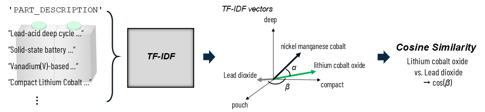

IN PROGRESS ...


Note: The battery data set is synthetic, since the original data set is confidential.


# IdenMat: Identifying alternative materials

This project focuses on identifying alternative electrode materials based on textual patterns in `PART_DESCRIPTION` using natural language processing (NLP) techniques. It leverages **TF-IDF vectorization** and **cosine similarity** to measure the relationship between materials and surrounding descriptive terms, with optional visualization and preprocessing strategies to improve data quality and interpretability.

**Note:** The battery data set is synthetic, since the original data set is confidential.



*Figure 1: TF-IDF vectorization and cosine similarity for identifying alternative battery electrode materials.*

---

## Table of Contents

1. [Overview](#overview)
2. [Project structure](#project-structure)
3. [Installation and Usage](#installation-and-usage)
4. [License](#license)
5. [Citing](#citing)

---

## Overview

The pipeline uses the `PART_DESCRIPTION` field of the dataset to derive embeddings for each material (e.g., "Lithium Cobalt Oxide") based on textual co-occurrence patterns. TF-IDF and cosine similarity are used to construct a similarity matrix, allowing the user to identify materials that are most closely associated with one another in practice. The approach consists of two main stages: **Preprocessing** and **Modeling**.

### Preprocessing

1. **Drop Duplicates**  
   Duplicate rows are removed to ensure that the dataset contains only unique entries.

2. **Impute `PART_DESCRIPTION` using `CATHODE_MATERIAL`**  
   For entries where `PART_DESCRIPTION` misses a material but `CATHODE_MATERIAL` is available, the value from `CATHODE_MATERIAL` is added to `PART_DESCRIPTION`.  
   More complex rule-based imputation is intentionally avoided to prevent introducing bias or noise into the TF-IDF representation.

### Modeling

1. **TF-IDF Vectorization**  
   - A TF-IDF vectorizer is applied to the `PART_DESCRIPTION` column to convert each entry into a vector of weighted term frequencies.  
   - This results in a matrix of shape: `(number of samples × number of unique terms)`.

2. **Averaging by Material**  
   - For each unique material (e.g., "Lithium Cobalt Oxide"), all TF-IDF vectors from entries associated with that material are averaged.  
   - This produces a single vector that represents the typical term distribution for that material.

3. **Material Matrix Construction**  
   - All material vectors are stacked together to form the `material_matrix`, where each row corresponds to a material.

4. **Cosine Similarity Computation**  
   - Cosine similarity is calculated across all pairs of material vectors in the `material_matrix`.  
   - A high similarity score indicates that two materials share similar descriptive language in `PART_DESCRIPTION`.

### Output

- The code prints the **top 5 most similar materials** for each material in the terminal.
- A **heatmap of cosine similarity scores** is saved to the `plots/` directory to visualize material relationships.

### Key Considerations

- The similarity scores are derived entirely from textual co-occurrence patterns in `PART_DESCRIPTION`.  
- Further improvement could involve integrating structured attributes into the description field or learning a joint embedding space using more advanced models (e.g., sentence transformers).

---

## Project Structure

The project is organized as follows:

```plaintext
IdenMat/
│
├── config/
│   └── config.yaml                 # Configuration file with paths and model parameters
│
├── data/
│   └── Battery.csv                 # Battery data set
│
├── plots/                          # Visualizations (battery material histogram, similarity heat map)
│
├── src/
│   ├── model.py                    # Model implementation (TF-IDF, Cosine similarity)
│   ├── preprocessing.py            # Data loading and cleaning
│   └── utils.py                    # Helper functions (plotting, etc.)
│
├── requirements.txt                # Python dependencies
└── main.py                         # Main execution script
```

---

## Installation and Usage

To set up the environment and run the project, follow these steps:

```bash
# 1. Clone the repository
git clone https://github.com/SimMarkt/IdenMat.git

# 2. Set up a virtual environment
python -m venv venv

# 3. Activate the virtual environment
# Windows:
.\venv\Scripts\activate

# 4. Install dependencies
pip install -r requirements.txt

# 5. Run the project
python main.py
```

---

## License

This project is licensed under [MIT License](LICENSE).

---

## Citing

If you use IdenMat in your research, please cite it using the following BibTeX entry:
```BibTeX
@misc{IdenMat,
  author = {Markthaler, Simon},
  title = {IdenMat: Identifying alternative battery electrode materials via unsupervised similarity matching},
  year = {2025},
  url = {https://github.com/SimMarkt/IdenMat}
}
```

---
